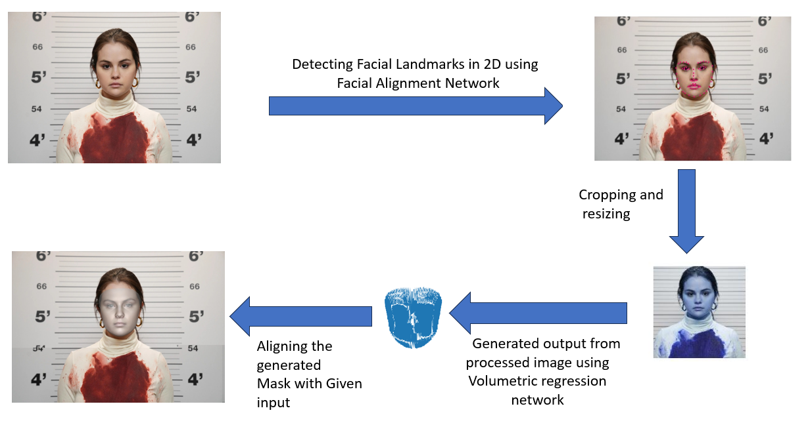

# 3D Face Reconstruction

This work implements [Large Pose 3D Face Reconstruction from a Single Image via Direct Volumetric Regression](https://arxiv.org/pdf/1703.07834.pdf),
which is CNN regression based model.We have implemented our model based on VRN unguided from the paper mentioned above.

Dataset is abstracted from [300W-3D](http://www.cbsr.ia.ac.cn/users/xiangyuzhu/projects/3DDFA/main.htm),We have only used input images but for the outputs we need to generate them customly using [3DDFA_V2](https://github.com/cleardusk/3DDFA_V2) through some slight modifications.

<p align="center">
  
</p>

### Usage

1. Clone this repo
   
```shell script
git clone https://github.com/Pani122/3DFaceReconstruction
```
2. Download the required data set into Dataset folder and process the dataset
```shell script
python3 cropper.py
```
Cropper.py converts the image size to 192x192 using Facial alignment network after detecting the faces present in the respective image.
```shell script
cd 3DDFA_V2_modified
```

3. Build the cython version of NMS, Sim3DR, and the faster mesh render
```shell script
sh ./build.sh
```

4. Generating dataset 
```shell script
# Make sure all the input files in the input folder and input images are of size 192x192x3
python3 generator.py 
cd ..
```
Here we are using images of size 192x192x3 because while training the model we are going to resize the image to 192x192 if the size is not matched,so the output produced from the network is 192x192x200.The output of the 3DDFA model is stored in a numpy matrix of size matching the 192x192x200.

5. Reaping the inputs for which faces were not detected
```shell script
python3 reaper.py
```
6. Training VRN
```shell script
python3 train.py
```
For training we have used crossentropy loss as the loss function and used RMSProp as an optimizer.We have used facial alignment network[FAN]
(https://github.com/1adrianb/face-alignment) inorder to resize the input image to 192x192,then we have passed it to VRN model.

7. Checking VRN
```shell script
python3 demo.py
```
This file generates 3D facial scan of the input mentioned in the file
